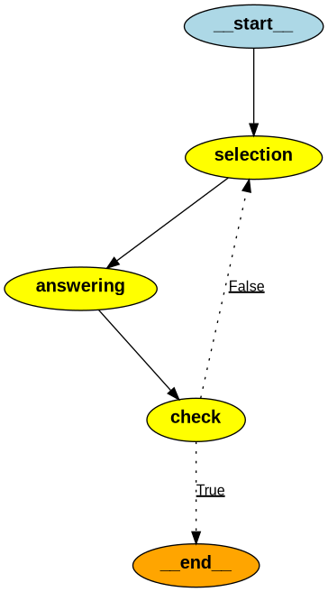

# QA Agent

LangGraph を使ったロールベースの Q&A エージェントです。質問内容を分析して適切なロールを自動選択し、品質チェックをパスするまで回答を繰り返し生成します。

## グラフ構成



```
[selection] → [answering] → [check] → 品質OK → END
                               ↑                  
                               └── 品質NG → [selection] に戻る
```

### 各ノードの役割

| ノード | 役割 |
|--------|------|
| `selection` | 質問を分析し、最適な回答ロールを選択する |
| `answering` | 選択されたロールに基づいて回答を生成する |
| `check` | 回答の品質を評価し、合否を判定する |

### 回答ロール

| ロール | 対象 |
|--------|------|
| 一般知識エキスパート | 幅広い分野の一般的な質問 |
| 生成AI製品エキスパート | 生成AIや関連技術に関する専門的な質問 |
| カウンセラー | 個人的な悩みや心理的な問題 |

## セットアップ

### 必要条件

- Python 3.13+
- [uv](https://docs.astral.sh/uv/)

### インストール

```bash
uv sync
```

### 環境変数

プロジェクトルートに `.env` ファイルを作成し、以下を設定してください。

```
ANTHROPIC_API_KEY=your_api_key_here
LANGCHAIN_API_KEY=your_langsmith_api_key_here
LANGCHAIN_TRACING_V2=true
LANGCHAIN_PROJECT=qa-agent
LANGCHAIN_ENDPOINT=https://api.smith.langchain.com
```

## 実行方法

```bash
uv run main.py
```

実行すると以下が出力されます。

- 最終回答（標準出力）
- グラフ構成の画像（`graph.png`）

### 質問の変更

`main.py` の以下の箇所を編集してください。

```python
initial_state = State(query="ここに質問を入力")
```
